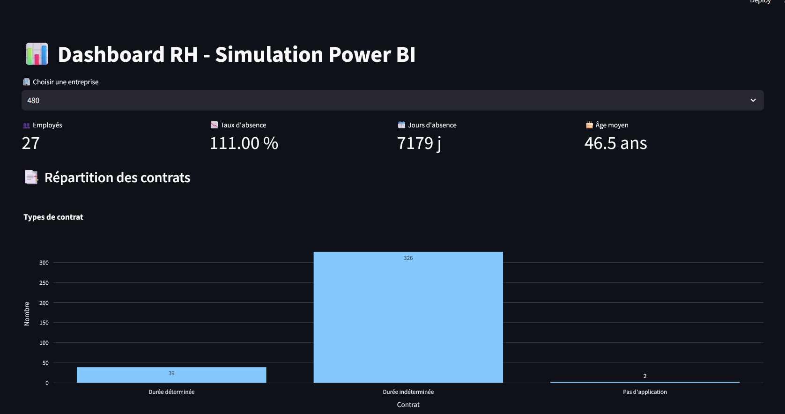
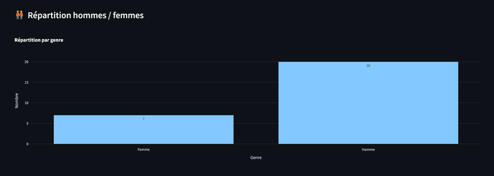

# 📊 Simulating Microsoft Fabric with Python & Streamlit

## Overview
This project replicates the logic of a Microsoft Fabric use case using only Python and Streamlit. Instead of relying on Fabric's integrated services (OneLake, Dataflows Gen2, Lakehouse, Power BI), we simulate each component with equivalent Python tools:

- **CSV input**: Raw data files from an HR domain
- **Lakehouse**: Modeled using a SQLite database
- **Dataflows Gen2**: Cleaned and transformed with `pandas`
- **Notebook/Engineering Layer**: Encapsulated logic in `model.py`
- **Power BI dashboard**: Recreated using Streamlit with interactive visualizations

---

## 📁 Project Structure
```bash
fabric_sim_python/
├── app/                     # Streamlit application files and semantic model
├── csv/                     # Raw CSV files (data input simulation)
├── notebooks/               # Jupyter notebooks for data exploration, semantic model exploration and lake house creation
├── pictures/                # Images and screenshots for documentation
├── README.md                # Project documentation
```

---

## 🧠 Semantic Model (`model.py`)
This file acts as the business layer. It:

- Loads and joins tables: `absence`, `contract_basis`, and `absence_type`
- Cleans and transforms data (e.g., handling NaNs, casting types)
- Calculates measures:
  - `total_absence_days`
  - `absence_rate`
  - `employee_count`
  - `gender_distribution_by_firm`
  - `average_age_by_firm`
- Reshapes the absence table (wide to long format) and enriches it using `absence_type`

Key functions:
- `load_data()`: Load and prepare the full dataset
- `load_absence_type()`: Load absence type reference table
- `enrich_absence_with_type()`: Pivot and join absence type descriptions
- `absences_by_type()`: Aggregate total days by absence type
- `total_employees_by_firm()` / `average_absence_rate_by_firm()` / `contract_type_distribution_by_firm()`
- `gender_distribution_by_firm()`: Count of men and women per company
- `average_age_by_firm()`: Compute mean age per company using birth date

---

## 📊 Dashboard (`app.py`)
A clean and interactive dashboard built with **Streamlit**, which simulates Power BI visuals.

Features:
- Select a company (`firm_id`) to filter the data
- KPIs:
  - Total employees
  - Average absence rate
  - Total days of absence
  - Average age
- Charts:
  - Contract type distribution (bar chart)
  - Absence type distribution (pie chart)
  - Gender distribution per firm (bar chart)

Future ideas:
- Filters by date (month, quarter, year)
- Breakdown by department or contract type
- Export data to Excel or CSV

---

## 💡 How to Run
1. Install dependencies:
```bash
pip install streamlit pandas plotly
```

2. Run the dashboard:
```bash
streamlit run app.py
```

---

## 🔥 Key Learnings
- Simulated a full Microsoft Fabric pipeline using open tools
- Reinforced concepts of semantic modeling and reporting
- Built a production-style dashboard with Python-only tools

---

## 📸 Screenshot
Here are some screenshots of the dashboard:

### Dashboard Overview


### Detailed Insights



---

## 🧑‍💻 Author
Adrien Piette  
Simulated Microsoft Fabric, one block at a time 🚀

